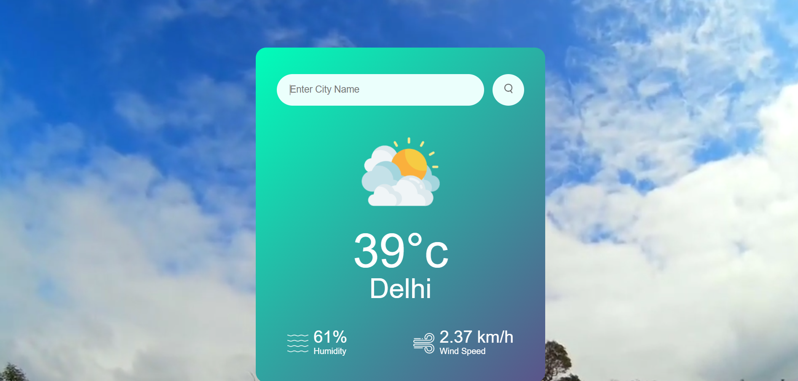
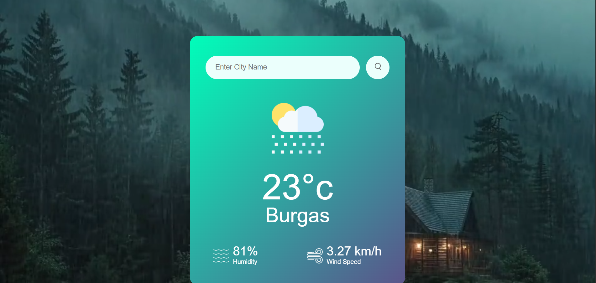
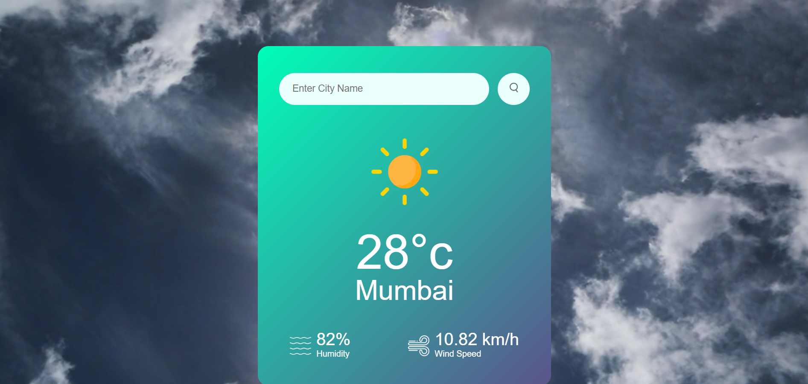

# Weather App

A weather web app built using **HTML, CSS, and JavaScript**.

This app fetches live weather data from the OpenWeatherMap API and dynamically updates the UI, including background videos that match real-time weather conditions. For realism, it currently handles **Cloudy, Rainy, and Clear** conditions, which are most likely worldwide in late June.

## 🌐 Live Demo

[🔗 View Live Demo](https://weather-app-ten-flame-90.vercel.app/) <!-- replace # with your deployed link if available -->

## 🚀 Features

- Live weather data fetching using the OpenWeatherMap API
- Displays:
  - City name
  - Temperature (°C)
  - Humidity
  - Wind speed
- Dynamic background videos for different weather conditions:
  - Cloudy
  - Rainy
  - Clear
- Responsive design for desktop and mobile screens
- Clean and modern user interface

## 📸 Screenshots

<!-- Add actual screenshot file paths if you have them -->




## 🛠️ Technologies Used

- HTML
- CSS
- JavaScript
- OpenWeatherMap API

## 📂 How to Run Locally

1. Clone this repository:
    ```
    git clone https://github.com/NeerajGupta-dev/weather-app.git
    ```
2. Open the project folder.
3. Open `index.html` in your web browser.

## 📜 License

This project is licensed under the MIT License.

---

### Author

[Neeraj Gupta](https://www.linkedin.com/in/neeraj-gupta-dev/)
